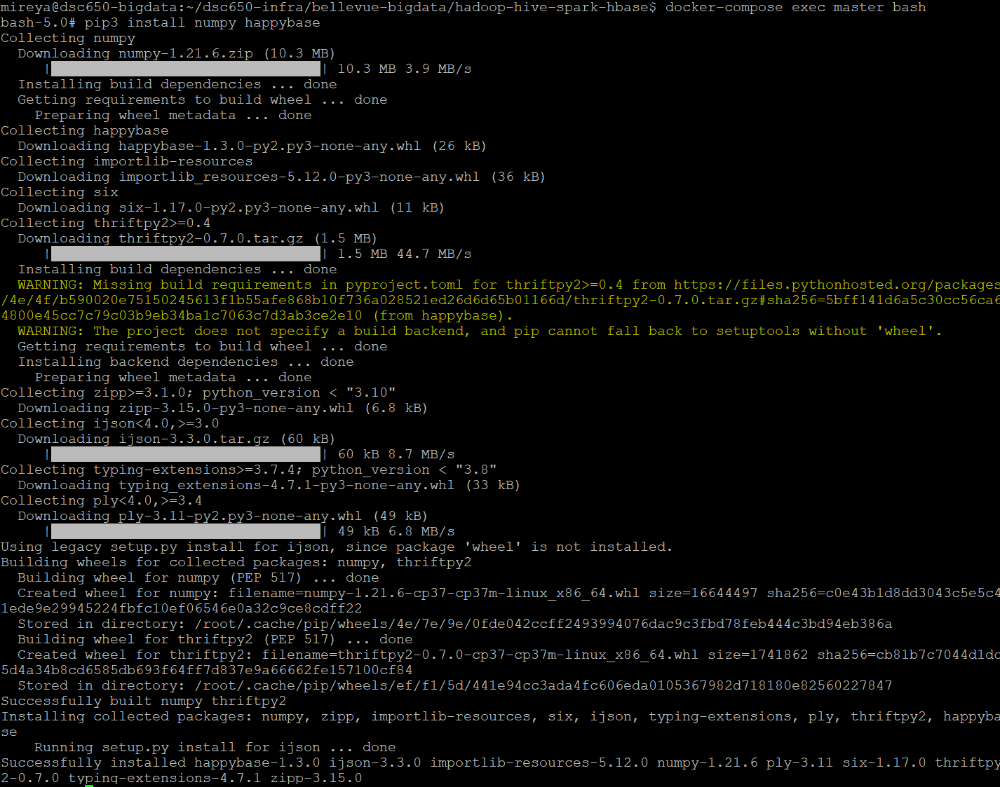
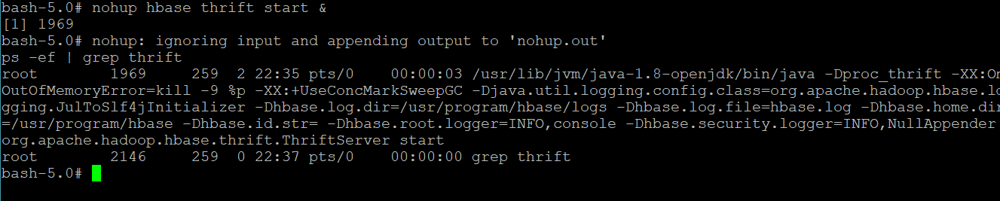

# Project Summary

## Implementation Overview

This project creates an end-to-end big data pipeline using Apache NiFi, HDFS, Hive, Spark MLlib, YARN, and HBase. The project uses the `customer_churn.csv` dataset, which was sourced from Kaggle and is stored in GitHub.

The pipeline begins with NiFi downloading the dataset from GitHub and writing it into HDFS. Hive is then used to create the `customer_churn` managed table so the data can be queried and accessed by Spark.

Next, the PySpark application reads the customer data from Hive and prepares the selected numeric variables for the machine learning model. Spark MLlib uses logistic regression to predict whether a customer will churn. The Spark application is submitted through YARN so the processing can run across the available worker nodes.

After the model is trained and evaluated, the accuracy and AUC results are written into the `churn_metrics` HBase table using HappyBase and the HBase Thrift server.

The completed pipeline follows this flow:

**Source Data → NiFi → HDFS → Hive → Spark MLlib → HBase**

Spark execution is submitted through **YARN**.

## Dataset

**Dataset name:** `customer_churn.csv`  
**GitHub direct URL:**(https://raw.githubusercontent.com/mflores0116/predicting_churn_pipeline/refs/heads/main/sample-data/customer_churn.csv)

The dataset contains 1,000 customer records with information about demographics, purchasing behavior, satisfaction, support activity, marketing engagement, and churn status.

I selected this dataset because it works well for a binary classification problem. The `target_churn` field identifies whether a customer churned, which makes it appropriate for a logistic regression model in Spark MLlib.

The dataset was also already cleaned, which allowed the project to focus more on building and connecting the big data pipeline components.

## Environment Setup

Before running the Spark MLlib application, the Python environment was prepared on the master and worker containers by installing the `numpy` and `happybase` packages.

These packages were installed using:

```bash
pip3 install numpy happybase
```

The HappyBase Python library is required because PySpark uses it to connect to HBase and write the final model-performance metrics. NumPy was installed for numerical and data-processing capabilities.

Both packages were installed on the master, worker1, and worker2 containers so the Python dependencies are available across the Spark environment.

### Package Installation Evidence



The package installation completed successfully, confirming that the Python environment is ready for the Spark-to-HBase part of the pipeline.

### HBase Thrift Server Evidence

The HBase Thrift server was started on the master container before running the Spark application.

The Thrift server provides the connection between the `happybase` library and HBase. This service is needed so that PySpark can write the accuracy and AUC values into the `churn_metrics` table. 

The service was started using:

```bash
nohup hbase thrift start &
```



The running HBase Thrift process confirms that the service is available before running the Spark MLlib application.

## What Worked

The complete pipeline successfully moved the customer churn dataset from GitHub through NiFi and into HDFS. Hive was then able to load the data into the `customer_churn` managed table and run SQL queries.

The Spark MLlib application was also able to read the Hive data, prepare the selected features, train a logistic regression model, and calculate accuracy and AUC values. The Spark job was submitted through YARN and used the worker nodes to complete the job across the cluster.

Finally, the accuracy and AUC values were writen into the `churn_metrics` HBase table using HappyBase and HBase Thrift server. This confirms that each part of the pipeline is able to work together from the ingestion to the final HBase output.

## Issues & Challenges Encountered

One of the main challenges of this project was getting all the different services to work together in the same environment. For example, I had to make sure the HDFS containers were running before NiFi could successfully write the dataset into HDFS. This showed me that each part of the pipeline needs to be set up before moving on to the next step.  

Since I was working with a virtual machine, I also had to keep track of which services were running in the same environment. After using NiFi to write the data to HDFS, I had to stop the NiFi services to make sure that enough resources were available for Hive, Spark, and HBase. This helped me understand why resource management is important when working with distributed systems.

The Spark output was also difficult to review because the logs were very long. I had to go through the output carefully to find the final accuracy and AUC values and confirm that the Spark application completed successfully. 

Another challenge was figuring out how to correctly use logistic regression with the customer churn data. Since `target_churn` was stored as a Boolean value, I needed to convert it into numeric so that Spark MLlib could use it. I also had to select the numeric predictor variables and combine them into a `features` vector using `VectorAssembler` before training the model. This helped me better understand how data needs to be prepared before it can be used in a machine learning model.

## Results

The final pipeline successfully moved the `customer_churn.csv` dataset from GitHub through NiFi and into HDFS. Hive then loaded the data into the `customer_churn` managed table, where I was able to confirm that all 1,000 records were available and run SQL queries on the dataset.

Spark MLlib successfully read the Hive table and trained a logistic regression model using the numeric variables. The model produced an accuracy of 0.49 and an AUC of 0.43651362984218084. These results showed that the model had limited predictive power, but the machine learning process completed successfully.

After the model was evaluated, the accuracy and AUC values were written into the `churn_metrics` HBase table under the `metrics1` row key. This confirms that the full pipeline worked from ingestion to the final HBase output.

## Lessons Learned

The biggest thing I learned from this project was how the different big data tools depend on each other. Before this project, I understood the tools mostly as separate technologies, but building the full pipeline showed me how they work together from ingestion through storage, SQL processing, machine learning, and final output.


## Production Considerations

Explain what you would change if this architecture were being deployed as a production system.

Possible areas to consider include:

- security and authentication;
- high availability;
- observability and monitoring;
- resource sizing;
- automation and CI/CD;
- data governance;
- secrets management;
- scalability and fault tolerance.

If this pipeline were used in a production environment, I would make changes to improve reliability and security. The main goal of this project was to make sure all of the technologies could work together correctly so the environment was kept simple and focused on demonstrating the full pipeline.

First, I would move data to a more permanent and secure storage location instead of using `/tmp` in HDFS. 

I would also improve the machine learning portion by using a larger dataset, including additional variables, and testing different models or feature combinations. The logistic regression model in this project had limited predictive performance, so more feature engineering and model tuning would be needed before using the results for real business decisions.

