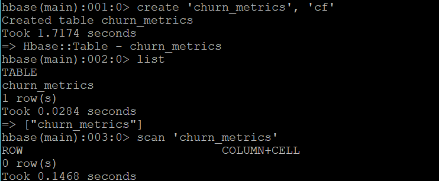
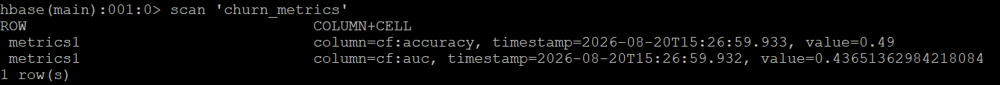

# Apache HBase — Model Metrics Persistence

## Role in the Pipeline

Apache HBase provides the NoSQL persistence layer for the machine learning metrics generated by Spark MLlib.

The HBase table is created before the Spark job runs, verified with an empty scan, populated by the PySpark application, and scanned again after execution to confirm that the model-performance metrics were successfully stored.

## Table Design

**Table name:** `churn_metrics`  
**Row key:** `metrics1`  
**Column family/families:** `cf`

The `churn_metrics` table stores the results generated by the customer churn prediction model. The row key, `metrics1`, will store the metrics produced when running the machine learning model. Using a single column family keeps the model results grouped together and makes it easy to retrieve them with an HBase scan.

The tables was created using:

create 'churn_metrics', 'cf'

## HBase Commands

The commands used to create and inspect the table are stored in:

[`commands.txt`](commands.txt)

## Empty Table Verification

Before running the Spark MLlib application, the `churn_metrics` table is scanned to confirm that it exists and is ready to store model results. The scan returned `0 row(s)` which shows that the table is currently empty and is ready for Spark to write the performance metrics. 

## Metrics Written by Spark

There were two model performance metrics produced by the Spark MLlib application. 

**Accuracy:** 0.49
**Area Under the Curve (AUC):** 0.43651362984218084

These metrics were selected because the target variable is a binary outcome (churn or not churn) so a logistic regression is the chosen model.

Accuracy means the proportion of customer records that the model correctly classified. It is the most straightforward way to see how often the model made the right prediction.

AUC, or area under the ROC curve, measures how well the model can tell the difference between the classes across decision thresholds. 

The results of this model indicate that the logistic regression model had moderate predictive power. 

## Populated Table Verification

Explain how the final populated scan confirms that Spark successfully wrote the model metrics into HBase.

This final scan provides end-to-end verification that the pipeline successfully moved from ingestion and distributed storage through SQL access, machine learning, and persistent NoSQL results.
