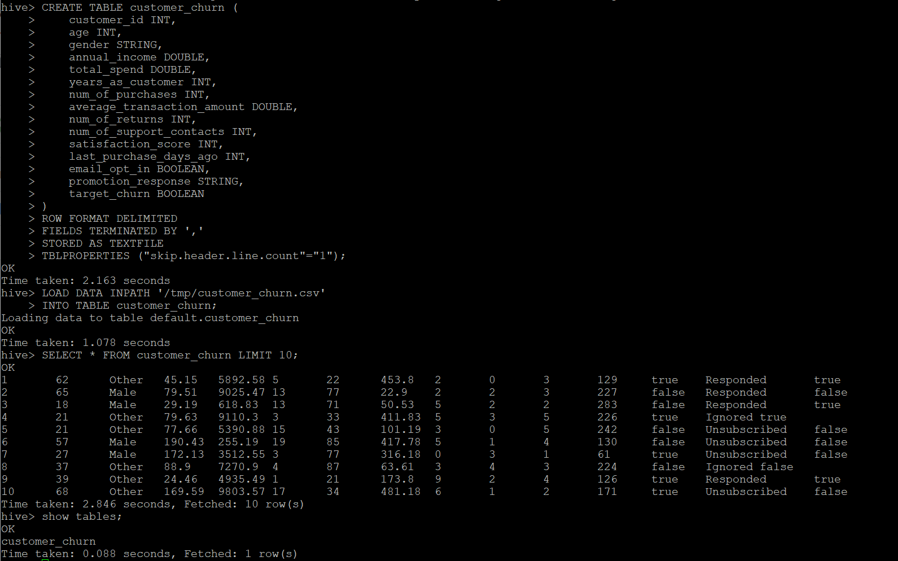
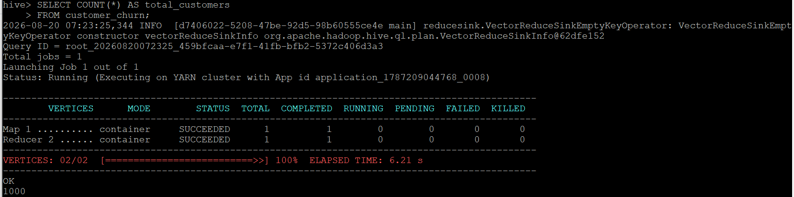
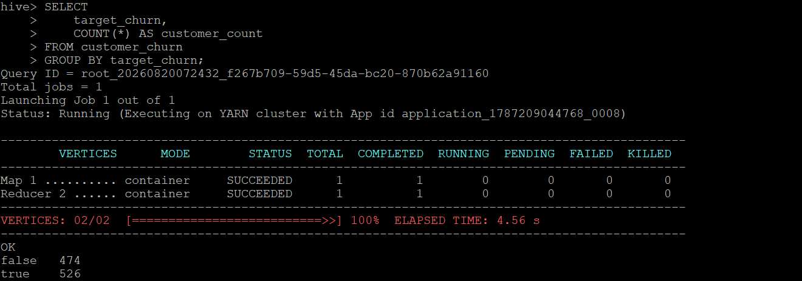
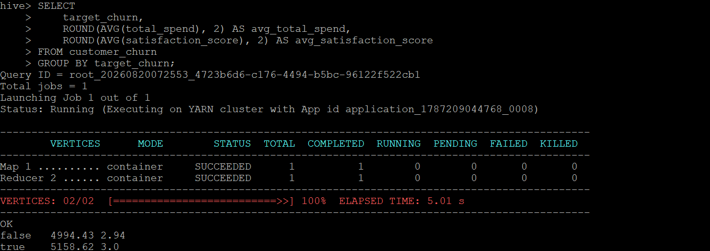

# Apache Hive — Managed Table & SQL Validation

## Role in the Pipeline

Apache Hive provides the structured SQL layer between HDFS storage and the Spark MLlib workload. The project data loaded through NiFi into HDFS is used to create and populate a Hive managed table.

## Hive Table Design

**Table name:** `customer_churn`

The `customer_churn` managed table has 15 columns that represent customer demographics, purchasing behavior, satisfaction, marketing engagement, and churn status. 

In this table schema, the numeric fields are `age`, `annual_income`, `total_spend`, `num_of_purchases`, and `satisfaction_score`. The categorical fields `gender` and `promotion_response` are stored as strings, while `email_opt_in` and `target_churn` are stored as Boolean values. 

The target variable for this Spark MLlib portion of this project is `target_churn` and identifies whether a customer churned.

The table was created as a managed Hive table using a CSV format. The header row was skipped so only the customer records were loaded into the table.

## SQL Files

- [`create_tables.sql`](create_tables.sql) — table creation and data-loading SQL
- [`queries.sql`](queries.sql) — validation, exploration, and aggregation queries

## Data Load Verification

The dataset was loaded from `/tmp/customer_churn.csv` in HDFS into the `customer_churn` managed Hive table. 

The data load was verified by displaying records from the table and confirming the values correctly match the Hive schema. A row-count query was also used to confirm that all 1,000 customer records were successfully loaded. 

## Query & Aggregation Verification

A series of queries were run to confirm the table was properly loaded and can be queried using SQL commands.

First, a row-count query was used to confirm that all 1,000 customer records were successfully loaded. 

From above, there are exactly 1,000 rows in the table so all data was loaded correctly.

Next, a churn aggregation query counted the number of customers in each target class:
  
  - No Churn (false): 474 customers
  - Churn (true): 526 customers

This confirms that all 1,00 customer records are represented in the churn target. Additionally, the two options are relatively well balanced.

The validated Hive table becomes the structured input used by the PySpark MLlib application.
