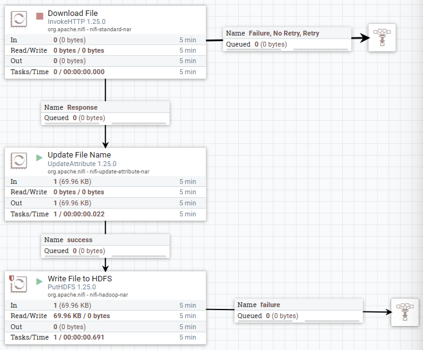
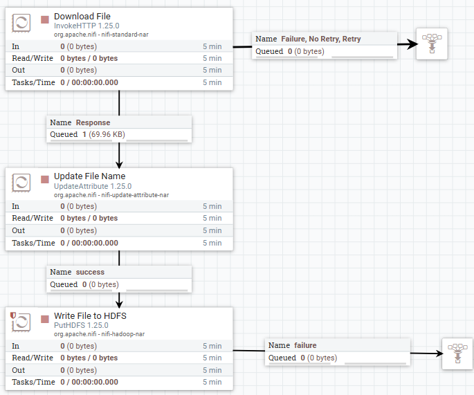
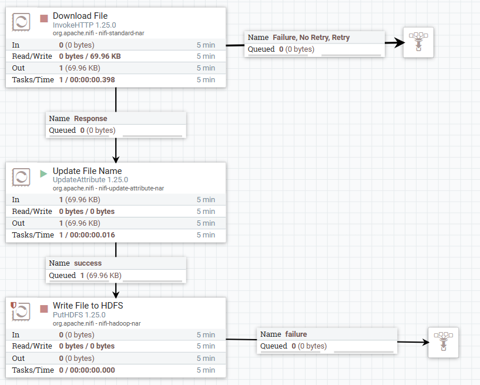
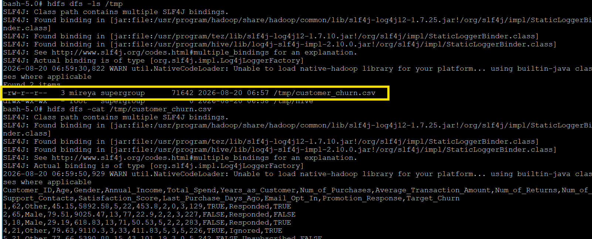

# Apache NiFi — Data Ingestion into HDFS

## Role in the Pipeline

Apache NiFi provides the ingestion and orchestration layer for this project. The completed flow retrieves the project dataset and writes it into HDFS for downstream processing.

## Source Dataset

**Dataset:** customer_churn.csv 

**GitHub direct URL:** https://raw.githubusercontent.com/mflores0116/bigdata_final/refs/heads/main/sample-data/customer_churn.csv

This dataset contains 1000 online customer retail records. It includes information about customer demographics, purchasing behavior, satisfaction, and marketing engagement. The variable of interest here is customer churn, which reflects how the customer interacts with the company. I selected this dataset because I wanted to explore consumer behavior and determine whether customer characteristics and activity could be used to predict churn. The dataset is already cleaned, which allows the focus of the project to be on building and demonstrating a working pipeline.

## Flow Design

The NiFi flow uses three processors to download the dataset, assign the correct file name, and write the file into HDFS. 
Describe the important processors used in the final NiFi flow and the role each processor performs.

| Processor / Process Group | Role in the Flow |
|---|---|
| Download File (InvokeHTTP) | Sends an HTTP Get request to download the `customer_churn.csv` into the Nifi flow |
| Update File Name (UpdateAttribute) | Updates the FlowFile `filename` attribute so the downloaded file has the correct project filename |
| Write File into HDFS (PutHDFS)| Writes the completed FlowFile into HDFS directory so it can be accessed by the next part of the pipeline|

This flow begins with the Download File processor, which retrieves `customer_churn.csv` from the GitHub URL. This downloaded data is placed into a FlowFile and passed to the Update File Name processor. This processor sets the filename to `customer_churn.csv`. Then, the FlowFile is passed to the Write File to HDFS processor, which connects and writes the dataset to HDFS.

## HDFS Destination

**HDFS path:** `/tmp`

Nifi write `customer_churn.csv` to the above HDFS directory using the PutHDFS processor. 

## Execution Evidence

### Final NiFi Flow

### Running Flow / Queue Activity

### HDFS Ingestion Verification

The HDFS screenshot should show the `hdfs dfs -ls` output confirming that the project dataset was successfully written into HDFS.
