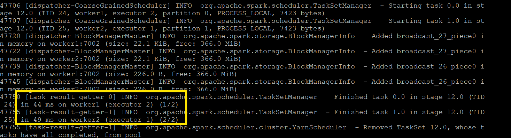
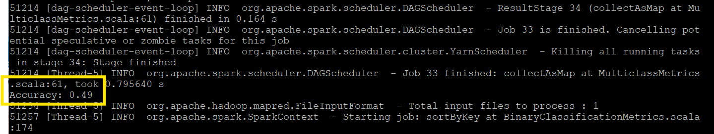
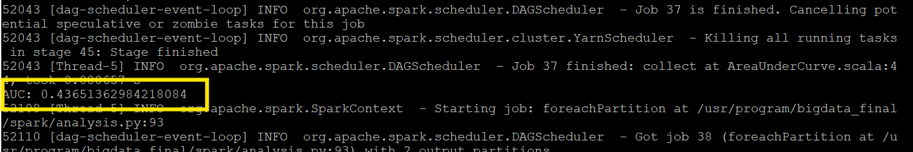
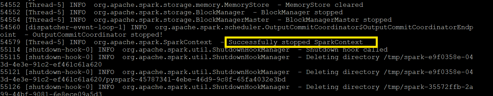

# Apache Spark MLlib — Distributed Machine Learning

## Role in the Pipeline

Apache Spark MLlib provides the distributed processing and machine learning layer for this project. The PySpark application reads project data from Hive, prepares the data for modeling, trains and evaluates a machine learning model, and generates model-performance metrics that are written into HBase.

## Hive Input

**Hive table:** `customer_churn`

Spark reads the customer churn data directly from the managed Hive table created earlier in the pipeline. The machine learning workflow uses numeric customer and purchasing variables as predictors and `target_churn` as the target variable.

The selected input features are:

- age
- annual_income
- total_spend
- years_as_customer
- num_of_purchases
- average_transaction_amount
- num_of_returns
- num_of_support_contacts
- satisfaction_score
- last_purchase_days_ago

The `target_churn` field identifies whether a customer churned and is used as the model label.

## Data Preparation & Transformations

To begin, only the numeric fields needed for the machine learning model are selected from the Hive table. Rows containing null values are removed using `na.drop()`. 

Since `target_churn` is stored as a Boolean value in Hive, it is converted to a numeric value so Spark MLlib can use it as the model label. 

Next, `VectorAssembler` combined the predictor columns into a single `features` vector that is required by Spark MLlib. 

Finally, the dataset is split into a training/testing set using a 70/30 split. A random seed of 1 is used to ensure reproducibility. 

## MLlib Algorithm

**Algorithm:** Logistic Regression

Logistic regression was chosen because the target variable is binary. Each customer is classified as either churned or not churned, making this a binary classification problem.

The model uses customer demographics, purchasing behavior and satisfaction score to predict `target_churn`. 

## Training & Evaluation

The logistic regression model was trained on 70% of the data and evaluated by predicting the remaining 30%. 

**Primary evaluation metric(s):** Accuracy and Area Under the ROC Curve (AUC)

The model produced the following results:

- Accuracy: 0.49
- AUC: 0.43651362984218084

Accuracy measures the proportion of customer records that were classified correctly. An accuracy of 0.49 means that approximately 49% of the test records were classified correctly.

AUC measures how well the model distinguishes between customers who churned and customers who did not churn across different decision thresholds. The AUC result of approximately 0.44 means that the model was unable to distinguish the two options reliably.

### Training Output

The training output shows Spark tasks being distributed across `worker1` and `worker2` through YARN. 



The completed task messages confirm that the Spark application was able to use the available worker nodes during the machine learning process.

### Model Evaluation



The evaluation output produced an accuracy of 0.49, meaning that approximately 49% of the test records were classified correctly by the logistic regression model.



The AUC value was 0.43651362984218084. This indicates that the model had limited ability to distinguish between customers who churned and customers who did not churn across different classification thresholds.

## Spark Submit / YARN Execution

The PySpark application was submitted through YARN using:

```bash
spark-submit \
  --master yarn \
  --deploy-mode client \
  --name CustomerChurn_to_HBase \
  analysis.py
```
The application successfully executed through YARN, with Spark tasks distributed across the available worker nodes. The logs showed the model training and evaluation process completing successfully, followed by Spark shutting down the application normally.



## HBase Output

After the model was evaluated, Spark wrote the two model-performance metrics into the churn_metrics HBase table:

- cf:accuracy
- cf:auc

Both values were stored under the row key metrics1.

The PySpark application connects to HBase through the HBase Thrift server using the happybase Python library. This allows the Spark application to store its final model performance results in HBase. This completed the final stage of the pipeline.

**PySpark source file:**  [`analysis.py`](analysis.py)
